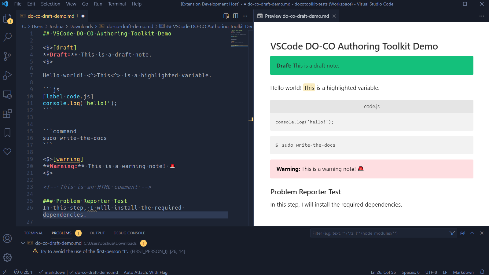
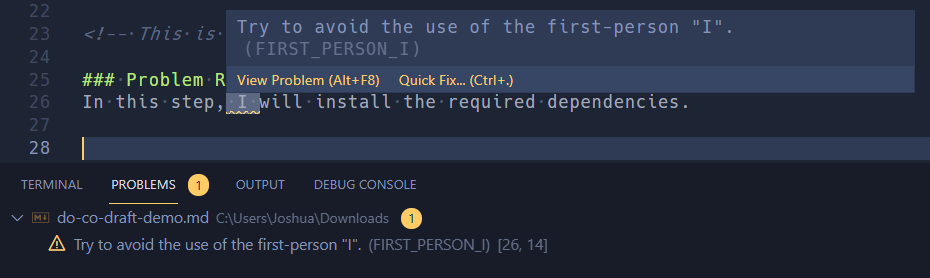

# do-co-authoring-toolkit
> Extension to help with the DigitalOcean authoring experience within VSCode.

> 💡 TIP: This extension requires flipping a setting to enable the altered Markdown preview and editor; see [*"Extension Settings"*](#extension-settings) for details.

## Features
### Markdown Preview
The main reason why this extension was prototyped in the first place, and probably the most impressive part of it: this extension alters the built-in VSCode Markdown preview panel to match the DigitalOcean Community site:

This preview should be an almost identical 1:1 match to [the official Markdown preview tool](https://www.digitalocean.com/community/markdown), but works locally, across all your Markdown files, and runs directly in VScode.

It does so by:

- Using [`markdown-it-do-co-pack`](https://github.com/joshuatz/markdown-it-do-co-pack) under the hood, a Markdown-it rule pack that supports the DO Community flavor of Markdown
- Combining the production CSS of the Community site with some specific VSCode overrides, and injecting it into the preview pane

> You can open the preview panel by using one of the built-in VSCode commands, like `Markdown: Open Preview to the Side`. For further instructions specific to the built-in preview pane functionality in VSCode, refer to [the official docs](https://code.visualstudio.com/docs/languages/markdown#_markdown-preview).

### Commands
Commands perform a specific task when run, and can be executed via [the *Command Palette*](https://code.visualstudio.com/docs/getstarted/userinterface#_command-palette), and from a few other spots.

The commands bundled with this extension are:

Command | Title | Description
--- | --- | ---
`removeDraftArtifacts` | DO-CO Toolkit: Remove Draft Artifacts (Clean) | Will remove *draft artifacts*, which are things in the Markdown source code that should not be included in publications, such as draft notes or HTML comments.
`rebuildCss` | DO-CO Toolkit: Rebuild Preview CSS | Rebuilds the generated CSS file that is used for the Markdown preview feature. You should use this command if DigitalOcean has updated the style of their community pages and the Markdown preview no longer matches.   Please do not use the command unnecessarily (you should almost never have to run this).

### Snippets
There are some bundled snippets included with this extension. If you are unfamiliar with [VSCode snippets](https://code.visualstudio.com/docs/editor/userdefinedsnippets), you can think of them like macros, which perform a small editing task, like inserting or replacing text.

You can find the included snippets in [`/snippets`](./snippets), or listed below:

Snippet Prefix | Description
--- | ---
DO-CO Note | Inserts a note for publication.
DO-CO Warning Note | Inserts a warning note to the users.
DO-CO Info Note | Inserts an info note.
DO-CO Draft Note | Inserts a draft note.
DO-CO Variable Highlight Wrap | Wraps selected text, or lines of text, as highlighted variables (`<^>your_text<^>`)

### Diagnostics
WIP: Right now, the only problem that is looked for is the use of "I" instead of "You". When applicable, this extension will try to provide *Quick-Fix* actions for reported problems.

## Requirements

No required system dependencies.

However, in order for the altered preview and editing experience to be enabled, you need to explicitly enable it via one of [the settings](#extension-settings):

## Extension Settings
This extension contributes the following settings:

* `jtz-do-co-authoring-toolkit.enable`: enable/disable this extension
* `jtz-do-co-authoring-toolkit.enabledPatterns`: Accepts an array of glob patterns to match against files in the editor, and enable the extension for. If set, overrides `.enable` setting.

> 💡 You must use one of settings above to explicitly enable the extension.

## Known Issues
For the Markdown preview feature, this extension modifies the default Markdown preview window by hooking into VSCode's Markdown-it plugin loader. Since it shares the webview with other Markdown extensions, it could potentially conflict with other rule sets.

It also forcefully disables certain rules that are known to conflict, and are unsupported by DigitalOcean Community - for example, the `math_inline` rule for KaTeX support (see [issue #2](https://github.com/joshuatz/vscode-do-co-authoring/issues/2)).

For bugs with the Markdown preview feature, most issues should get posted to [the `markdown-it-do-co-pack` repository](https://github.com/joshuatz/markdown-it-do-co-pack), which is the pack of Markdown-it rules powering this extension's preview feature.

## Release Notes

Version | Date | Notes
--- | --- | ---
`0.0.1` | TBD | Initial Release 🚀

## Disclaimers
> *DigitalOcean* is a registered trademark of DigitalOcean, LLC. This tool is not affiliated with nor endorsed by DigitalOcean or the DigitalOcean Community in any *official* capacity.

## Backlog / TODO
- Publish! (check below guidelines first)
- Add more [Programmatic Language Features](https://code.visualstudio.com/api/language-extensions/programmatic-language-features)
	- Example: Offer autocomplete when typing `<$>[`, with options of `draft`, `note`, `warning, ` or `info`
- Add Icon(s)
- Finalize naming conventions
- Add command to open the formatting guide (via short link redirect)

### Following extension guidelines

Ensure that you've read through the extensions guidelines and follow the best practices for creating your extension.

* [Extension Guidelines](https://code.visualstudio.com/api/references/extension-guidelines)
